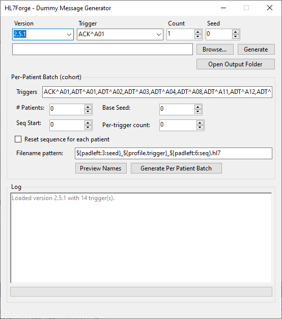

# HL7Forge

HL7Forge is a Windows-first .NET 8 toolkit to generate safe, synthetic HL7 v2 messages for testing and integration work.



## Projects
- `HL7Forge.Core` — message composer, faker, profiles, maps.
- `HL7Forge.Cli` — console: generate batches to disk.
- `HL7Forge.Gui` — minimal WinForms UI.

## Quick Start (CLI)
```powershell
# Requires .NET 8 SDK
cd src/HL7Forge.Cli
dotnet build
dotnet run -- ADT^A01 2.5.1 25 1234 .\out
# trigger version count seed outDir
```

## Quick Start (GUI)

Download the latest release from the releases section of this repository or you can compile this application yourself. 

```powershell
cd src/HL7Forge.Gui
dotnet build
dotnet run
```

## Features

- Deterministic synthetic patient data (stable across runs via seed).
- Supports people.json dictionaries for more realistic PI.
- Safe PI policy (no real identifiers).
- Segment maps (*.map.json) for overrides without recompilation.
- Constants (constants.json) to centralize facility defaults.
- Repeat ranges for randomized segment repetitions.

### Supported triggers

HL7Forge discovers triggers from `Profiles/<version>/*.json` (excluding `constants.json`, `people.json`, and `*.map.json`).  

**We currently include**, the following profiles:

- **ADT**: `ADT^A01`, `ADT^A02`, `ADT^A03`, `ADT^A04`, `ADT^A08`, `ADT^A11`, `ADT^A12`, `ADT^A13`, `ADT^A28`, `ADT^A31`, `ADT^A40`
- **ACK**: `ACK^A01`
- **ORM**: `ORM^O01`
- **ORU**: `ORU^R01`

> Add or remove profiles in `Profiles/<version>/` and HL7Forge will pick them up automatically (GUI dropdown is populated from this folder).

## Included segment builders

- AL1 
- DG1 
- ERR 
- MSH 
- EVN 
- LOC 
- MRG 
- MSA 
- NK1 
- NTE 
- OBR 
- OBX 
- ORC 
- PD1 
- PR1 
- PRD 
- PV1 
- PV2 
- RF1 
- ROL 
- SPM